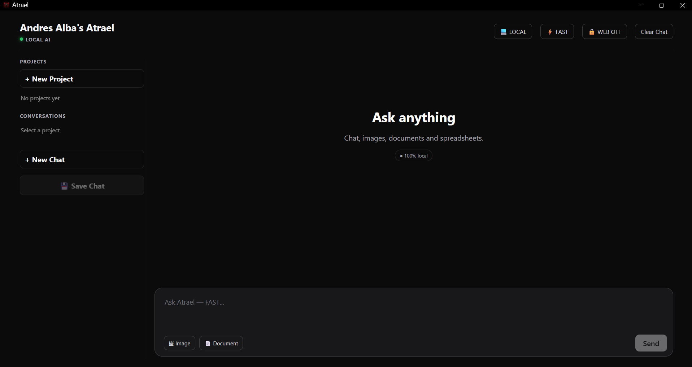
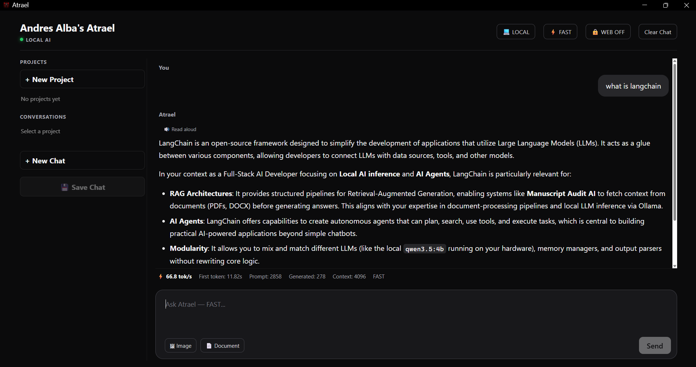
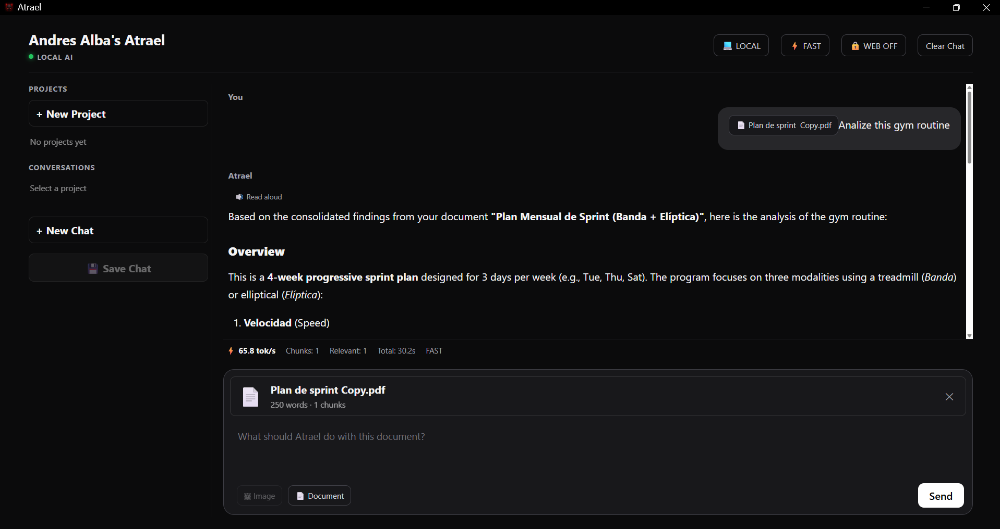
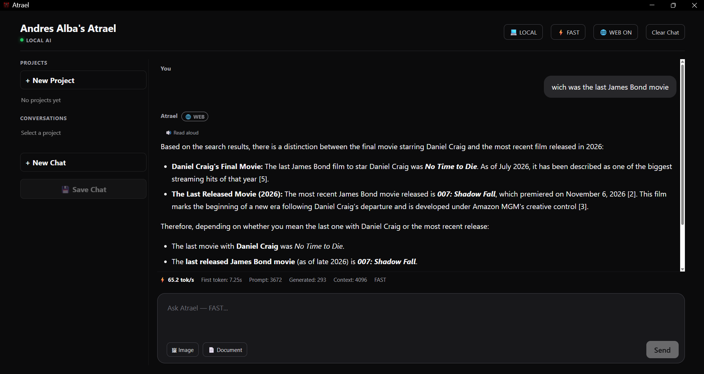

# Atrael

> **A private, local-first AI workstation for chat, vision, documents, spreadsheets, large-scale document analysis, and optional web-assisted research — powered by locally hosted AI models.**

**Atrael** is a full-stack local AI application built with **React, Node.js, Ollama, and multimodal language models**.

It turns a consumer computer into a private AI workstation capable of:

* Running multiple local LLMs
* Streaming AI responses in real time
* Analyzing images and screenshots
* Reading PDFs, DOCX, Markdown, and text files
* Analyzing Excel and CSV spreadsheets
* Processing documents far larger than a model's context window
* Performing exhaustive chunk-by-chunk analysis
* Hierarchically consolidating large sets of findings
* Reading responses aloud
* Reporting inference performance in real time
* Optional web-assisted AI responses
* Web-assisted document analysis
* Privacy-oriented local search-query generation
* Separation between document evidence and external web information

All core AI inference runs locally.

No OpenAI API.
No Gemini API.
No Anthropic API.
No cloud AI dependency required.

---

## Screenshots

### Local AI



### Local AI Chat



### Document Intelligence



### Web-Assisted Analysis



## Why Atrael?

Most local AI demos stop at:

```text
Prompt
  ↓
Ollama
  ↓
Response
```

Atrael goes significantly further.

It explores what is required to turn local inference into a practical **AI workstation**:

```text
Chat
+
Vision
+
Programming
+
Documents
+
Spreadsheets
+
Large-document pipelines
+
Multiple model profiles
+
Streaming
+
Text-to-speech
+
Inference observability
```

All inside one application.

The goal is not simply to provide a graphical frontend for Ollama.

The goal is to build a usable **local AI system** around it.

---

# Key Engineering Highlights

## 🔒 Local-First AI

The default AI request path remains on the user's machine:

```text
Browser
   │
   ▼
React
localhost:5180
   │
   ▼
Node / Express
localhost:3050
   │
   ▼
Ollama
127.0.0.1:11434
   │
   ▼
Local AI Model
   │
   ▼
GPU / RAM
```

Uploaded documents are processed with local Node.js libraries.

AI inference is executed through locally installed Ollama models.

Atrael does not require:

* OpenAI
* Google Gemini
* Anthropic
* Azure OpenAI
* AWS AI services
* Google Vision
* External OCR APIs
* External document-analysis APIs

After dependencies and AI models are installed, the application's core AI workflow is designed to operate locally.

---

## 🧠 Multi-Model Architecture

Atrael supports different local model profiles for different workloads.

### LOCAL

```text
qwen3.5:4b
```

Optimized for fast interactive work.

Best suited for:

* Programming
* General questions
* Image analysis
* Screenshots
* Quick document review
* Spreadsheet analysis
* Summaries
* Everyday productivity

Measured on the development machine:

```text
GPU: NVIDIA RTX 4060 Laptop
VRAM: 8 GB

~67 tokens/second
~0.3–0.4 s warm first-token latency
100% GPU execution
```

---

### ATRAEL

```text
Qwen 27B local model profile
```

The larger model is intended for workloads where deeper analysis matters more than latency.

Typical use cases include:

* Complex analysis
* Long-form reasoning
* Manuscript review
* Detailed interpretation
* Deep document analysis
* Creative work
* Tasks where the lightweight model is insufficient

The installed quantized model is approximately:

```text
18 GB
```

Because the model is larger than the available 8 GB of GPU VRAM, Ollama uses a combination of:

```text
GPU
+
System RAM
```

Measured generation speed on the development machine:

```text
~3–4 tokens/second
```

This creates a deliberate two-tier architecture:

```text
LOCAL
Qwen 3.5 4B
Fast / interactive workloads

        vs.

ATRAEL
27B local model
Deep / heavier workloads
```

The user can switch computational profiles without leaving the application.

---

# ⚡ FAST and QUALITY Modes

Model selection and inference strategy are independent.

Either model can use the available processing modes.

## FAST

```text
Context: 16384
Thinking: OFF
```

Optimized for responsiveness.

Recommended for:

* Conversation
* Programming
* Quick analysis
* Image understanding
* Short documents
* Interactive work

---

## QUALITY

```text
Context: 32768
Thinking: ON
```

Designed for more difficult tasks where additional reasoning is valuable.

Recommended for:

* Complex questions
* Multi-step reasoning
* Difficult comparisons
* Analytical work
* Tasks where latency is less important

---

# 📚 Large-Document Intelligence

One of Atrael's main engineering features is its ability to analyze documents that are much larger than the active model context.

Instead of attempting to send an entire large file to the model, Atrael uses a multi-stage pipeline.

```text
Large Document
      │
      ▼
Text Extraction
      │
      ▼
Chunking
      │
      ├── Chunk 1
      ├── Chunk 2
      ├── Chunk 3
      ├── ...
      └── Chunk N
             │
             ▼
     Individual AI Analysis
             │
             ▼
        Relevant Findings
             │
             ▼
    Hierarchical Consolidation
             │
             ▼
         Final Synthesis
```

This allows Atrael to work with source material that would otherwise exceed the context capacity of the model.

---

## Exhaustive Analysis

For investigative tasks, every chunk can be evaluated against the user's instruction.

Example:

```text
Find contradictions between all archetype definitions.
```

Atrael evaluates:

```text
Chunk 1
Chunk 2
Chunk 3
...
Chunk N
```

Each chunk returns either relevant findings or:

```text
NO_RELEVANT_FINDINGS
```

Useful location metadata can be retained, including:

```text
CHUNK
PAGE
SHEET
ROW
SECTION
```

This makes the system useful for tasks that require locating information rather than merely generating a high-level summary.

---

# 🌳 Hierarchical Consolidation

Large documents can generate more intermediate findings than will fit into one final model context.

Atrael addresses this through recursive consolidation.

```text
Hundreds of findings
        │
        ▼
Group 1 → consolidation
Group 2 → consolidation
Group 3 → consolidation
...
        │
        ▼
Reduced findings
        │
        ▼
Further consolidation
        │
        ▼
Bounded final context
        │
        ▼
Final answer
```

This keeps the final context bounded even when the original source material is substantially larger.

---

# 📊 Document Processing Progress

Large analyses expose processing progress directly in the interface.

Example:

```text
Analyzing document

34 / 287

████████████░░░░░░░░░░

12%
```

Possible stages include:

```text
Starting analysis
Analyzing document
Consolidating findings
Preparing final answer
Writing final answer
```

Generation can also be interrupted from the UI.

---

# 👁️ Local Image Analysis

Compatible multimodal Ollama models can receive images directly.

Example tasks:

```text
Transcribe all visible text in this screenshot.
```

```text
What error appears in this image?
```

```text
Explain this user interface.
```

```text
Analyze this chart.
```

```text
Describe what is happening in this image.
```

Processing follows the local path:

```text
Image
  │
  ▼
React
  │
  ▼
Node
  │
  ▼
Ollama
  │
  ▼
Local multimodal model
```

No external computer-vision API is required.

---

# 📄 Supported Documents

Atrael currently supports:

### Documents

```text
.pdf
.docx
.txt
.md
```

### Spreadsheets

```text
.xlsx
.xls
.csv
```

### Images

```text
.png
.jpg
.jpeg
.webp
```

---

# 📊 Spreadsheet Intelligence

Excel and CSV files are converted locally into structured text representations while preserving:

* Sheet names
* Rows
* Columns
* Cell values
* Numerical information

Example internal representation:

```text
[SHEET: Sales]

Row 1:
Date: 2026-08-01
Seller: Carlos
Product: Laptop
Quantity: 2
Total: 8000000
```

This enables natural-language questions such as:

```text
Which seller generated the highest revenue?
```

```text
Which products generated the most income?
```

```text
Find unusual values.
```

```text
Compare Sheet1 with Sheet2.
```

```text
Identify possible inconsistencies.
```

---

# 📄 PDF Processing

PDF files are parsed locally.

The extraction pipeline attempts to preserve page boundaries:

```text
[PAGE 1]
...

[PAGE 2]
...

[PAGE 3]
...
```

This makes location-aware analysis possible.

For example:

```text
Find all inconsistencies in this document and tell me
on which pages they appear.
```

---

# 📝 DOCX Processing

Microsoft Word documents are processed locally with Mammoth.

```text
DOCX
  │
  ▼
Mammoth
  │
  ▼
Extracted text
  │
  ▼
Chunking
  │
  ▼
Local AI
```

No Microsoft cloud service is required.

---

# 🌊 Real-Time Streaming

Atrael streams model output rather than waiting for the complete response.

```text
User Prompt
     │
     ▼
Node Backend
     │
     ▼
Ollama
     │
     ▼
First Token
     │
     ▼
Browser
     │
     ▼
Next Token
     │
     ▼
...
```

This provides a responsive ChatGPT-style interaction even though inference is running locally.

---

# ⛔ Generation Cancellation

Users can stop an active generation.

Cancellation propagates from the browser toward the backend and Ollama request.

This is especially useful for:

* Large models
* Very long responses
* Incorrect prompts
* Large-document jobs
* Expensive reasoning runs

---

# 📈 AI Performance Observability

Atrael exposes model-performance information directly in the UI.

For normal inference:

```text
Tokens / second
First-token latency
Prompt tokens
Generated tokens
Context size
Inference mode
```

Example:

```text
⚡ 67.1 tok/s
First token: 0.31s
Prompt: 102
Generated: 839
Context: 4096
FAST
```

Document analysis can additionally report:

```text
Chunks processed
Relevant chunks
Total processing time
Tokens / second
Mode
```

This makes the behavior of local models visible rather than treating inference as a black box.

---

# 🔊 Local Read Aloud

AI responses can be read aloud directly from the application.

```text
AI Response
    │
    ▼
Browser SpeechSynthesis API
    │
    ▼
Operating-System Voice
    │
    ▼
Audio Output
```

The implementation prefers voices reported by the browser as local when available.

No dedicated external text-to-speech service is required.

---

# 🏗 Architecture

```text
┌─────────────────────────────┐
│       React Frontend        │
│      localhost:5180         │
└──────────────┬──────────────┘
               │
               │ HTTP / Streaming
               ▼
┌─────────────────────────────┐
│    Node / Express Backend   │
│      localhost:3050         │
└──────────────┬──────────────┘
               │
       ┌───────┴──────────┐
       │                  │
       ▼                  ▼
 Local Parsers          Ollama
                         │
 PDF / DOCX              │
 XLSX / CSV              ▼
 TXT / MD           Local AI Models
                         │
                         ▼
                     GPU + RAM
```

---

# 🛠 Tech Stack

## Frontend

* React
* Vite
* JavaScript
* React Markdown
* Remark GFM
* Fetch API
* Streams API
* FileReader API
* Speech Synthesis API

## Backend

* Node.js
* Express
* Multer
* Mammoth
* pdf-parse
* SheetJS / XLSX
* Native Fetch API
* Streaming NDJSON

## AI

* Ollama
* Qwen 3.5 4B
* Qwen 27B local model profile
* Multimodal local inference
* NVIDIA GPU acceleration
* CPU / RAM offloading

---

# 💻 Development Hardware

Atrael was developed and tested on:

```text
CPU:
AMD Ryzen 7 8845HS

RAM:
64 GB

GPU:
NVIDIA GeForce RTX 4060 Laptop GPU

VRAM:
8 GB

OS:
Windows 11
```

The lightweight model fits completely inside GPU memory.

The larger 27B model exceeds available VRAM and therefore uses GPU + system-memory processing.

Performance results shown in this README were measured on this machine and should not be interpreted as universal benchmarks.

---

# 🚀 Installation

## Requirements

Recommended:

```text
Windows or Linux
Node.js 18+
npm
Ollama
16+ GB RAM
NVIDIA GPU recommended
```

For larger models:

```text
32+ GB system RAM recommended
```

Exact requirements depend on model size, context size, and quantization.

---

## Clone

```bash
git clone https://github.com/andresalba-tech/atrael
cd atrael
```

---

## Backend

```bash
cd backend
npm install
node server.js
```

Backend:

```text
http://localhost:3050
```

---

## Frontend

From the project root:

```bash
cd frontend
npm install
npm run dev
```

Vite normally exposes:

```text
http://localhost:5180
```

---

# 🦙 Ollama

Verify Ollama:

```bash
ollama --version
```

Install the lightweight model:

```bash
ollama pull qwen3.5:4b
```

Verify installed models:

```bash
ollama list
```

Atrael can also be configured to use compatible alternative models installed through Ollama.

---

# 🎮 GPU Verification

Check active Ollama models:

```bash
ollama ps
```

Monitor NVIDIA GPU usage:

```bash
nvidia-smi
```

Continuous monitoring:

```bash
nvidia-smi -l 1
```

---

# ✅ Atrael V1

Current implementation includes:

* [x] Local AI chat
* [x] Ollama integration
* [x] Multiple local model profiles
* [x] FAST mode
* [x] QUALITY mode
* [x] Streaming responses
* [x] Stop generation
* [x] Clear conversation
* [x] Markdown rendering
* [x] Code blocks
* [x] Performance metrics
* [x] Image upload
* [x] Image analysis
* [x] Screenshot analysis
* [x] PDF analysis
* [x] DOCX analysis
* [x] TXT support
* [x] Markdown support
* [x] XLSX support
* [x] XLS support
* [x] CSV support
* [x] Large-document chunking
* [x] Exhaustive chunk analysis
* [x] Hierarchical consolidation
* [x] Final document synthesis
* [x] Document-processing progress
* [x] Local temporary file processing
* [x] Read Aloud
* [x] Local-first AI architecture

---

# 🌐 Optional Web Access

Atrael can optionally complement local AI inference with web search.

When web access is enabled, Atrael generates a privacy-oriented search query locally and retrieves external search results that can be supplied to the local model as additional context.

For document analysis, Atrael keeps the two evidence sources conceptually separate:

```text
Document Evidence
        +
External Web Information
        ↓
Final Analysis

```
# 🧪 Automated Testing

Atrael includes automated backend regression tests for critical functionality.

Current test suite:

```text
Test Files: 5 passed
Tests:      31 passed

```
# 🔐 Privacy

Atrael is designed around local processing.

The default AI architecture does not require prompts, documents, images, or spreadsheets to be transmitted to a cloud AI provider.

Users working with sensitive information should nevertheless review the security and privacy characteristics of their complete environment, including:

* Operating system
* Browser
* Browser extensions
* Installed dependencies
* Network configuration
* Ollama configuration
* Future integrations

Local-first architecture should not be interpreted as a guarantee about every other application running on the same operating system.

---

# 🛡 Security

Atrael V1 is primarily designed as a **single-machine local workstation**.

The development backend should not be exposed directly to the public Internet.

Any network-accessible or production deployment should add appropriate controls such as:

* Authentication
* Authorization
* HTTPS
* Rate limiting
* File validation
* Network restrictions
* Request-size limits
* Sandboxing
* Security auditing

---

# 🗺 Roadmap

Possible future development includes:

* Persistent conversation history
* Local conversation database
* Local RAG
* Local embeddings
* Semantic document search
* Multi-document collections
* Document citations
* Conversation export
* Improved spreadsheet reasoning
* Syntax highlighting
* Copy-code controls
* Response regeneration
* Editable previous prompts
* Advanced model management
* Context controls
* Voice selection
* Dedicated local TTS
* Local speech-to-text
* Drag-and-drop files
* Clipboard screenshot support
* GPU / RAM monitoring in the interface
* Desktop packaging

---

# What This Project Demonstrates

Atrael combines several areas of practical AI engineering in one system:

**Local inference engineering**

Running and coordinating language and multimodal models through Ollama.

**Full-stack AI integration**

Connecting React, Node.js, streaming HTTP workflows, local models, parsers, and browser APIs.

**Context-window engineering**

Processing source material larger than the model's available context through chunking and hierarchical reduction.

**Multimodal AI**

Sending image data to local vision-capable language models.

**Document intelligence**

Building ingestion pipelines for PDFs, DOCX files, spreadsheets, Markdown, and plain text.

**Inference optimization**

Choosing between small fast models and larger computationally expensive models according to workload.

**AI observability**

Measuring latency, throughput, token usage, processing time, and document-analysis progress.

**Privacy-oriented architecture**

Keeping the core AI workflow on infrastructure controlled by the user.

---

# Project Philosophy

The central idea behind Atrael is simple:

> **A useful local AI system should be more than a chat box connected to a model.**

It should be capable of choosing different computational profiles, understanding different forms of information, processing large datasets and documents, exposing its performance, and providing a polished interactive experience.

Atrael is an exploration of how much of that experience can be built **locally, privately, and on consumer hardware**.

---

# License

No license has been selected yet.

Until a license is explicitly added, the repository should not be assumed to grant unrestricted permission to copy, modify, or redistribute the source code.

---

# Author

**Andres Alba**

Senior Software Developer / Full-Stack AI Developer

LinkedIn:

https://www.linkedin.com/in/andr%C3%A9s-eduardo-alba-matallana/

Atrael was created as a practical exploration of **local AI engineering, multimodal inference, large-document processing, AI performance optimization, privacy-first architecture, and full-stack application development**.
